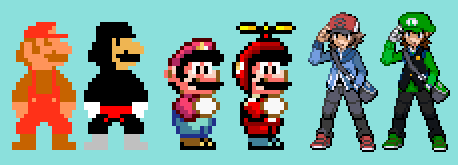
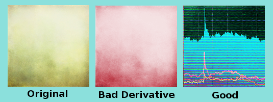
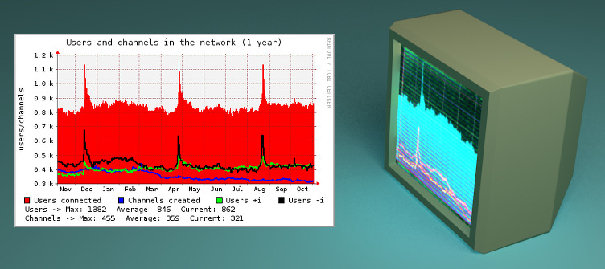

+++
title = "Derivative Works"
weight = 100
[taxonomies]
Categories = ["Rules","Art","Music"]
+++

Derivative works vaguely describe what we recommend. We don't want to limit how you create your visuals, but we want you to be careful when you do it.

We don't Police submissions, but do understand that participants criticize Compo games more harshly. They expect to see games created entirely from scratch. If it's obvious that assets are borrowed and edited, your fellow participants **may score you poorly**.

Here are some **bad derivatives** (not necessarily bad looking):

You can easily see the silhouette and details of the **original** (left) in the **derivative** (right).

While this is technically a derivative, there's a big problem: **the original artwork belongs to Nintendo**, who doesn't grant permission to do this sort of thing (these are fan works, harmless, but still legally grey). If you plan to create artwork this way, you should enter the **Jam** instead.

Colorizing a grain texture is _technically_ a derivative, but it's not a very good one.

A better derivative uses the grain texture to add detail. For example, we [start with a chart](http://www.afternet.org/stats), blend it with a distorted version of the grain texture, apply a scanline post-process effect, and play with our levels. The result is something that could go on a CRT TV, health monitor, or anything Sciencey.

A good derivative transforms a work in to something new.

If you need to make reference to a well known character, then make the character your own.

_Marios by: [Johan Peitz], Jinn, fyaro2k, [Sos Sosowski], geno2925, and Jinn_

Draw it to the best of your ability. Your fellow participants are mostly programmers, so don't feel you need to make good art.

“Programmer Art” is welcome (and encouraged). 😀

## Music

Music is a highly derivative artform (I mean that in the best way possible). Songs are often constructed from samples, loops (repeating samples), virtual instruments (sometimes made of samples), or recordings (technically also a sample). Sampling is almost inescapable in music today.

To demonstrate, we'll start with a set of audio samples:

https://soundcloud.com/ludumdare/sets/derivative-work-example

Here is a song created using these samples:

https://soundcloud.com/ludumdare/derivative-work-example-song-alarmed-by-kevin-bradshaw

Thanks to [Kevin Bradshaw](https://twitter.com/_Gaeel_) for making this.
